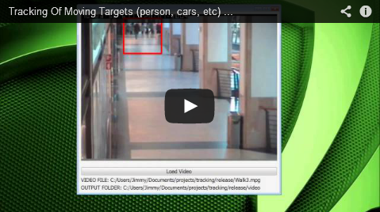

Tracking of Moving Targets
==========================

Objective
---------

The objective of this code is to detect moving targets in a video using OpenCV. The code was written in C++ and uses Qt for the GUI.

Features
--------

* Background subtraction using mixture of Gaussians
* Qt Graphical User Interface
* Shadow detecting capabilities
* Collision detection capabilities
* Active stabilization
* Save target frames to video

